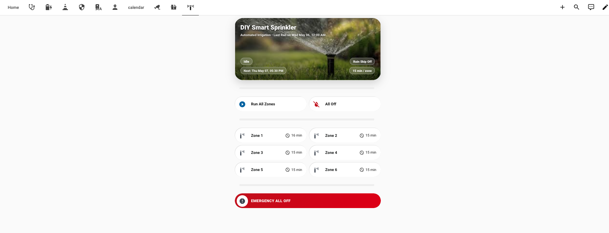
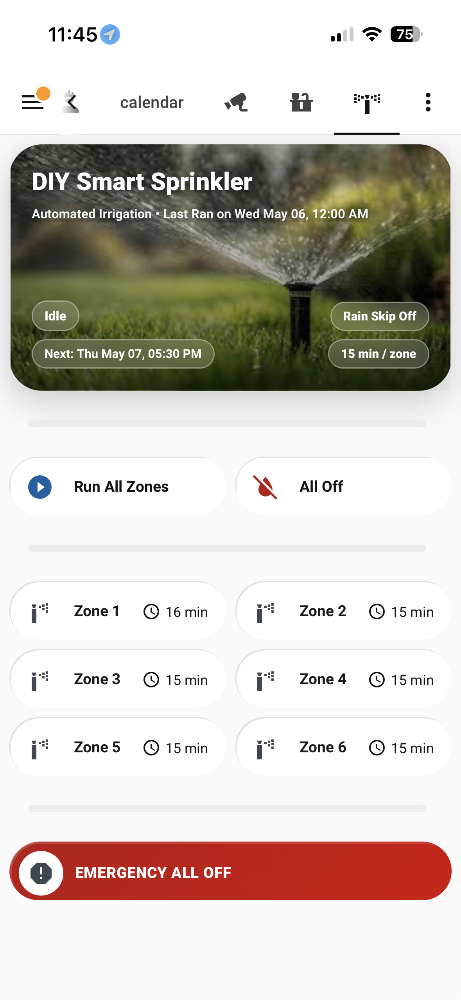

# DIY Smart Sprinkler

A Raspberry Pi + Home Assistant DIY irrigation controller using GPIO-controlled relay outputs, a local Flask API, and Home Assistant automations/dashboard controls.

This project turns a Raspberry Pi 2 running Raspberry Pi OS Bookworm into a local sprinkler controller for a 6-zone irrigation system using a SainSmart 16-channel 12V relay board.

## Features

- Raspberry Pi GPIO control
- 6 sprinkler zones
- Local Flask API
- Home Assistant integration using `rest_command`
- Home Assistant dashboard card
- Manual zone control
- Run-all-zones script
- Emergency all-off command
- **Manual override mode** with configurable auto-expiry (default 4 hours)
- **Vacation mode** — pause all scheduling for a configurable number of days
- **Per-zone runtime overrides** — set each zone independently (5–60 min)
- **7-day rolling runtime history** per zone
- **WhatsApp notifications** on run start, completion, skipped runs, manual mode expiry, and safety shutoff
- Rain skip toggle (manual and automatic weather-based)
- Weather-adjusted runtime reference sensor
- Last run / next run display
- Mode indicator: AUTO / MANUAL / VACATION / RAIN SKIP
- Safety shutoff: any zone running >40 minutes is automatically cut off

## Screenshots

### Web View



### Phone View



## Hardware Used

This build was tested with:

- Raspberry Pi 2 Model B
- Raspberry Pi OS Bookworm
- [SainSmart 16-Channel 12V Relay Module](https://www.sainsmart.com/products/16-channel-12v-relay-module)
- Existing 24VAC sprinkler transformer
- Existing sprinkler valves / solenoids
- Home Assistant

Notes:

- The relay board is powered separately from the Raspberry Pi.
- The Raspberry Pi controls only the relay input pins.
- The sprinkler valves are switched through the relay contacts using the existing 24VAC sprinkler transformer.
- This setup uses 6 of the 16 available relay channels.

## GPIO Mapping

| Zone | BCM GPIO | Raspberry Pi Physical Pin |
|---|---:|---:|
| Zone 1 | GPIO4 | Pin 7 |
| Zone 2 | GPIO17 | Pin 11 |
| Zone 3 | GPIO27 | Pin 13 |
| Zone 4 | GPIO22 | Pin 15 |
| Zone 5 | GPIO23 | Pin 16 |
| Zone 6 | GPIO24 | Pin 18 |

## Relay Behavior

This relay board is controlled using an open-drain style pattern:

| Action | GPIO Behavior |
|---|---|
| Zone ON | Drive GPIO LOW |
| Zone OFF | Release GPIO as input |

The Python API uses `lgpio` directly so that OFF releases the GPIO instead of driving it HIGH.

## Install Path Assumption

This guide assumes the Raspberry Pi app is installed at:

```text
/root/sprinkler
```

The included `sprinkler.service` file uses that path.

Advanced users may prefer installing to:

```text
/opt/sprinkler
```

and using `network-online.target` instead of `network.target` in the systemd service.

## Raspberry Pi Setup

Install required packages:

```bash
sudo apt update
sudo apt install -y python3-flask python3-lgpio
```

Create the app directory:

```bash
sudo mkdir -p /root/sprinkler
```

Copy the API server:

```bash
sudo cp raspberry-pi/server.py /root/sprinkler/server.py
```

Copy the systemd service:

```bash
sudo cp raspberry-pi/sprinkler.service /etc/systemd/system/sprinkler.service
```

Enable and start the service:

```bash
sudo systemctl daemon-reload
sudo systemctl enable sprinkler
sudo systemctl start sprinkler
sudo systemctl status sprinkler
```

## API Endpoints

The Flask API listens on port `5050`.

Replace `<PI_IP_ADDRESS>` with the Raspberry Pi IP address.

### Get API info

```bash
curl http://<PI_IP_ADDRESS>:5050/
```

### Get zone state

```bash
curl http://<PI_IP_ADDRESS>:5050/zone/1
```

### Turn a zone on

```bash
curl -X POST http://<PI_IP_ADDRESS>:5050/zone/1 -d "on"
```

### Turn a zone off

```bash
curl -X POST http://<PI_IP_ADDRESS>:5050/zone/1 -d "off"
```

### Emergency all off

```bash
curl -X POST http://<PI_IP_ADDRESS>:5050/alloff
```

## Home Assistant Setup

Sample Home Assistant YAML files are in:

```text
home-assistant/
```

You will need all of these files:

- `rest_command.yaml`
- `scripts.yaml`
- `automations.yaml`
- `sensors.yaml`
- `template.yaml`
- `input_boolean.yaml`
- `input_datetime.yaml`
- `input_number.yaml`
- `dashboard.yaml`

Make sure your `configuration.yaml` includes the relevant split files:

```yaml
rest_command: !include rest_command.yaml
script: !include scripts.yaml
sensor: !include sensors.yaml
template: !include template.yaml
input_boolean: !include input_boolean.yaml
input_datetime: !include input_datetime.yaml
input_number: !include input_number.yaml
```

If you already use split files, merge the examples into your existing files.

### Recorder Retention

The 7-day runtime history sensors use `history_stats` which queries the HA recorder database. The default recorder retention (10 days) is sufficient, but adding a safety margin is recommended. In `configuration.yaml`:

```yaml
recorder:
  purge_keep_days: 14
```

### WhatsApp Notifications (Optional)

Notifications use `script.whatsapp_me` via the OpenWA integration. If you don't have this set up, all notification steps will fail silently — the rest of the automation and script logic continues normally. The `continue_on_error: true` flag is set on all notification calls so nothing breaks if OpenWA is not running.

## Home Assistant Commands

The project uses `rest_command` instead of REST switches.

This avoids Home Assistant accidentally sending OFF commands during state refresh.

Example:

```yaml
sprinkler_zone_1_on:
  url: "http://<PI_IP_ADDRESS>:5050/zone/1"
  method: POST
  payload: "on"

sprinkler_zone_1_off:
  url: "http://<PI_IP_ADDRESS>:5050/zone/1"
  method: POST
  payload: "off"

sprinkler_all_off:
  url: "http://<PI_IP_ADDRESS>:5050/alloff"
  method: POST
```

## Modes

### AUTO (default)

The schedule automation runs at 5:30 AM and 5:30 PM if no skip conditions are active.

### MANUAL

Toggle `input_boolean.sprinkler_manual_mode` on to pause all scheduling. Manual mode auto-expires after the configured timeout (default 4 hours, adjustable via `input_number.sprinkler_manual_timeout_hours`). A WhatsApp notification is sent when it expires and the system returns to AUTO.

Changing the timeout value while manual mode is already active does not update the current countdown — the delay was evaluated at trigger time. Turn manual mode off and back on to apply a new timeout value.

Individual zones can still be turned on and off directly from the dashboard while in manual mode.

### VACATION

Call `script.sprinkler_set_vacation` to enable vacation mode. It reads `input_number.sprinkler_vacation_days` (default 7) and sets `input_datetime.sprinkler_vacation_until` to that many days from now. All scheduling is paused until that date. Vacation mode turns off automatically at midnight on or after the vacation-until date (within ~24 hours of expiry).

### RAIN SKIP

`input_boolean.sprinkler_rain_skip` can be toggled manually or is set automatically by the `Enable Rain Skip When Raining` automation when `weather.home` reports rainy/pouring/lightning-rainy. It resets automatically at 3:00 AM daily.

## Per-Zone Runtime

Each zone has a configurable runtime via `input_number.sprinkler_zone_N_runtime` (5–60 min, default 20). These values are used directly by `script.sprinkler_run_all_zones` and replace the weather-adjusted runtime for scheduling purposes. The `Sprinkler Adjusted Runtime` sensor still displays a weather-based suggestion as a reference.

## Safety Shutoff

The `Sprinkler Safety Shutoff Per Zone` automation fires if any single zone is on continuously for more than 40 minutes. It calls `sprinkler_all_off`, creates a persistent notification, and sends a WhatsApp alert.

This is a per-zone trigger using `for: "00:40:00"` on the state trigger — it will not fire during a normal multi-zone run where each zone runs for less than 40 minutes.

## Dashboard

The included dashboard YAML uses:

- Bubble Card
- Button Card

Install these through HACS before using the dashboard:

- `custom:bubble-card`
- `custom:button-card`

The dashboard includes:

- Mode-aware hero card (AUTO = green, MANUAL = amber, VACATION = blue, RAIN SKIP = gray)
- Run All Zones and All Off action buttons
- Manual Mode toggle (amber when active, shows configured timeout hours)
- Vacation Mode button (tap = set vacation for configured days, hold = toggle directly)
- Zone controls (tap = on, hold = off) with today's runtime and 7-day runtime chips
- Emergency all-off button

## Home Assistant Entities

### input_boolean

| Entity | Purpose |
|---|---|
| `input_boolean.sprinkler_rain_skip` | Manual rain skip toggle |
| `input_boolean.sprinkler_manual_mode` | Manual override mode |
| `input_boolean.sprinkler_vacation_mode` | Vacation mode |

### input_number

| Entity | Default | Purpose |
|---|---|---|
| `input_number.sprinkler_manual_timeout_hours` | 4 | Hours before manual mode auto-expires |
| `input_number.sprinkler_vacation_days` | 7 | Days to pause when vacation mode is set |
| `input_number.sprinkler_zone_1_runtime` | 20 | Zone 1 runtime in minutes |
| `input_number.sprinkler_zone_2_runtime` | 20 | Zone 2 runtime in minutes |
| `input_number.sprinkler_zone_3_runtime` | 20 | Zone 3 runtime in minutes |
| `input_number.sprinkler_zone_4_runtime` | 20 | Zone 4 runtime in minutes |
| `input_number.sprinkler_zone_5_runtime` | 20 | Zone 5 runtime in minutes |
| `input_number.sprinkler_zone_6_runtime` | 20 | Zone 6 runtime in minutes |

### input_datetime

| Entity | Purpose |
|---|---|
| `input_datetime.sprinkler_last_run` | Timestamp of last completed run |
| `input_datetime.sprinkler_vacation_until` | Date when vacation mode ends |

### Key sensors

| Entity | Purpose |
|---|---|
| `sensor.sprinkler_mode` | Current mode: AUTO / MANUAL / VACATION / RAIN SKIP |
| `sensor.sprinkler_active_zone` | Which zone is currently running, or Idle |
| `sensor.sprinkler_last_ran` | Human-readable last run timestamp |
| `sensor.sprinkler_next_run` | Human-readable next scheduled run |
| `sensor.sprinkler_adjusted_runtime` | Weather-based runtime suggestion (reference only) |
| `sensor.vacation_countdown` | Days remaining in vacation mode |
| `sensor.zone_N_runtime_minutes` | Today's runtime for zone N (minutes) |
| `sensor.zone_N_runtime_this_week_minutes` | 7-day rolling runtime for zone N (minutes) |

## Wiring Overview

Sprinkler relay contact wiring per zone:

```text
24VAC HOT  -> Relay COM
Relay NO   -> Zone wire
24VAC COMMON stays connected to all valves
```

Do not switch the valve common wire.

Do not connect Raspberry Pi GPIO to 24VAC.

See:

```text
docs/wiring.md
```

for more wiring detail.

## Safety Notes

- This project switches sprinkler valve control wiring.
- The Raspberry Pi should never be connected directly to sprinkler 24VAC.
- Use relay isolation.
- Keep the Raspberry Pi and relay board dry.
- Only one zone is enabled at a time by the API.
- Use the emergency all-off command if anything behaves unexpectedly.
- This project has no authentication by default.
- Run it only on a trusted local network.
- If you are not comfortable, hire a licensed electrician and plumber/landscaper for help.

## Troubleshooting

### The relay clicks once but does not toggle

The board may require open-drain style control.

This project handles that by:

- ON: GPIO output LOW
- OFF: GPIO input / released

### Zone turns off after a short time

If curl testing works but Home Assistant turns the zone off, avoid REST switches and use `rest_command`.

### API does not start after reboot

Check:

```bash
sudo systemctl status sprinkler
sudo journalctl -u sprinkler -f
```

### Test the API locally on the Pi

```bash
curl http://localhost:5050/
```

### Test the API from another machine

```bash
curl http://<PI_IP_ADDRESS>:5050/
```

### 7-day runtime sensors show 0

Check that `recorder: purge_keep_days` in `configuration.yaml` is at least 7. The sensors need recorder history to compute rolling totals.

## Project Structure

```text
diy-smart-sprinkler/
├── README.md
├── LICENSE
├── raspberry-pi/
│   ├── server.py
│   ├── sprinkler.service
│   └── requirements.txt
├── home-assistant/
│   ├── rest_command.yaml
│   ├── scripts.yaml
│   ├── automations.yaml
│   ├── sensors.yaml
│   ├── template.yaml
│   ├── input_boolean.yaml
│   ├── input_datetime.yaml
│   ├── input_number.yaml
│   └── dashboard.yaml
└── docs/
    ├── wiring.md
    └── screenshots/
        ├── phone-view.png
        └── web-view.png
```

## License

MIT License.
